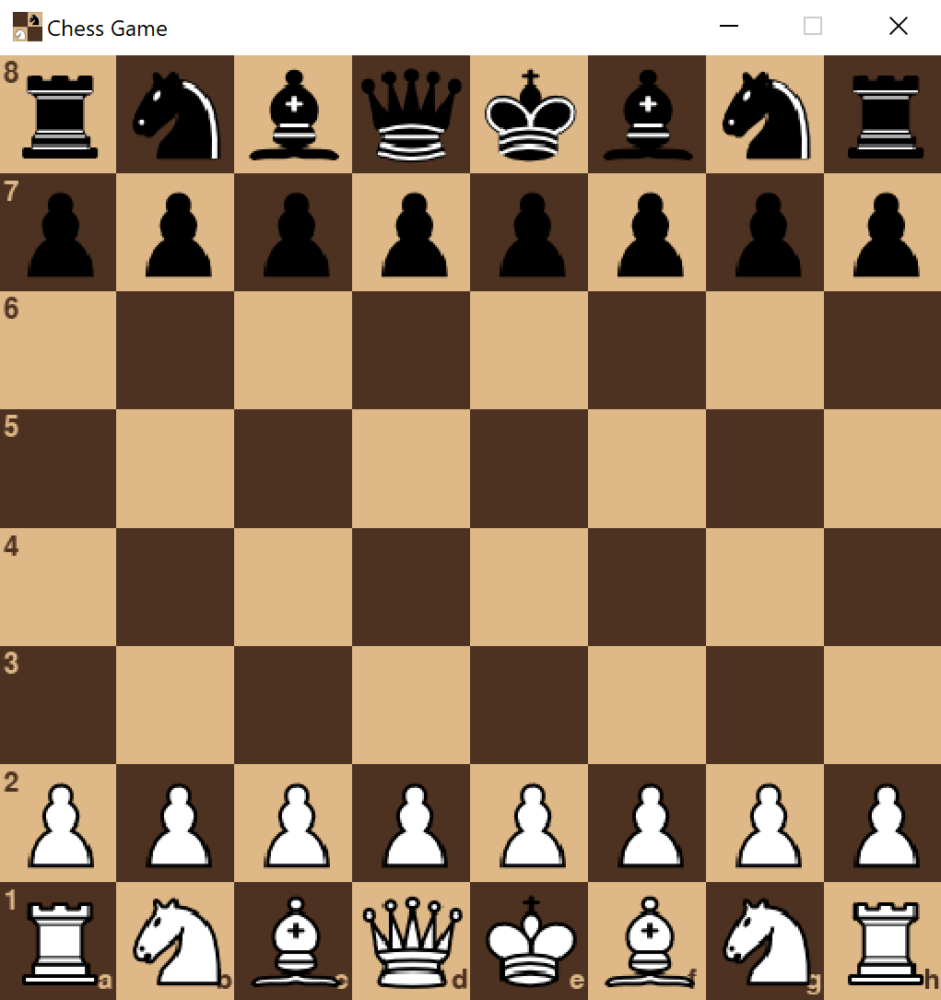
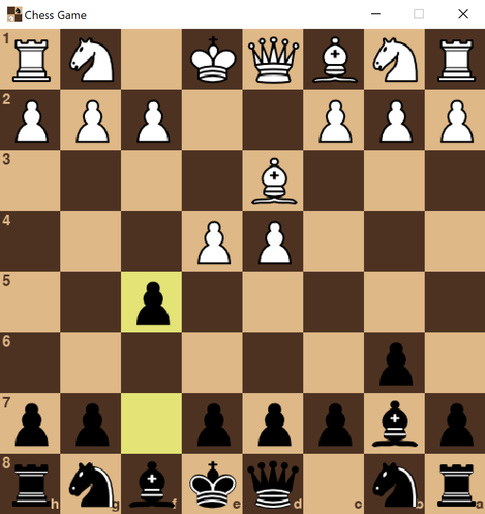

# Chess Game Project

## Overview

This project is my personal implementation of Chess using Python.

## How to Run

This repository does not currently have an executable that runs the Chess game, and can only be accessed by a Python interpreter (or virtual environment) that meets these conditions:

- Uses Python version 3.6 or higher
- Has the `pygame` module installed, which can be obtained using the following command:

  ```
  pip install pygame
  ```

Once these conditions are met, you may run `main.py` using any one of the following commands:

### MacOS/Linux

```
python3 main.py
```

### Windows

```
python main.py
```

## Screenshot(s)

### Program start:



### Opening position:



## License

None (public domain)
